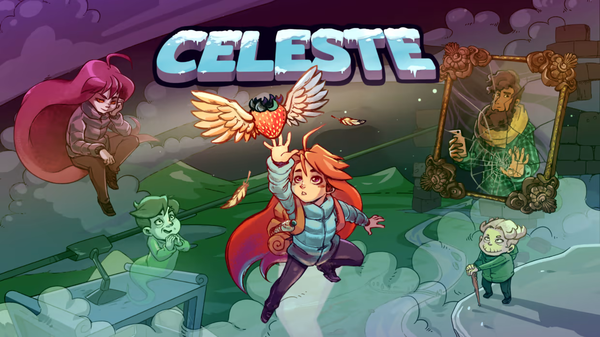

<!-- GENERAL GAME INFO -->
 

  <h1 align="center">Celeste</h1>

  

    Help Madeline survive her inner demons on her journey to the top of Celeste Mountain, in this super-tight platformer from the creators of TowerFall. Brave hundreds of hand-crafted challenges, uncover devious secrets, and piece together the mystery of the mountain.
     
    <strong>Original game : </strong>
    <a href="https://en.wikipedia.org/wiki/Celeste_(video_game)"><strong>General info »</strong></a>
    ·
    <a href="https://www.youtube.com/watch?v=6GlTmtXA7WA"><strong>Youtube video »<strong></a>
     
     
  

<!-- TABLE OF CONTENTS -->

  
Table of Contents

  <ol>
    <li>
      <a href="#about-the-project">About The Project</a>
    </li>
    <li>
      <a href="#my-version">My version</a>
    </li>
    <li>
      <a href="#getting-started">Getting Started</a>
    </li>
    <li><a href="#how-to-play">How To Play</a></li>
    <li><a href="#class-structure">Class structure</a></li>
    <li><a href="#checklist">Checklist</a></li>
    <li><a href="#contact">Contact</a></li>
    <li><a href="#acknowledgments">Acknowledgments</a></li>
  </ol>

<!-- ABOUT THE PROJECT -->
## About The Project

Why I chose Celeste:
- 1 of my all-time favorite platformers
- Breathtaking pixel artstyle
- Beautiful synth music
- Precise and coordinated fast-paced gameplay

(<a href="#readme-top">back to top</a>)

## My version

This section gives an overview on which parts of the original game I plan to make.

I will re-create the Badeline boss fight from Chapter 6 called reflection in as much detail as possible.

    <a href="https://www.youtube.com/watch?v=H9xwR2jB26k"><strong>Bossfight video»<strong></a>

### The minimum I will most certainly develop:
I listed a lot of things which might seem to much to handle. But I don't have to do the 3D1 course so this frees time for programming 2.

#### Level:
* 10 screens (entire chase/fight sequence is 21 screens)
* Per screen all obstacles/things Madeline can collide with, die from or interact with
    - falling platforms
    - disappearing platforms
    - pink spikes
    - jump springs
* Smooth Screen transitions

#### Mechanics:
Madeline:
* Move left/right
* Jump
* Crouch
* Grab
* Dash, Super Dash, Hyper Dash, Extended Super Dash, Extended Hyper Dash

    <a href="https://celestegame.fandom.com/wiki/Moves"><strong>Mechanics Wiki,<strong></a>
    <a href="https://www.youtube.com/watch?v=-SQKKG7Dz5c"><strong>Mechanics Video<strong></a>

Badeline:
* Badeline laser attack
* Badeline Bullet attack

#### Pickups:
* Dash Crystals

#### Graphics:
* Pixel art tileset for "main" layer Madeline sits on/collides with
* Sprite Animations for Madeline mechanics
* Sprite Animation for Badeline mechanics
* Background wind effect
* Particle effects for Madeline mechanics
* Particle effects for Badeline attacks

#### Sound:
* Background music
* Sound effects for:
  - jumping
  - dashing
  - hitting Badeline
  - badeline Bullet Attack
  - badeline Laser Attack
  - collecting Dash Crystals
  - falling platforms

### What I will probably make as well:
Depends on how much time I have left, see section below.

### What I plan to create if I have enough time left:
* All 21 screens
* Other player mechanics
* Tentacles following Badeline (foreground and background layer)
* Other background layers
* Talking sequences with Badeline (text bubbles)
* Environment animations (water, plants)
* Lighting effects around Madeline and Badeline

(<a href="#readme-top">back to top</a>)

<!-- GETTING STARTED -->
## Getting Started
### Prerequisites
* Visual Studio 2022
* !!Only controller support, tested with PS4 controller, XBOX controller will proably work as well!!

### How to run the project
* Get the latest project version from GitHub or find the .zip on leho
* Open DAE_Jeroen_Denayer.sln
* Press ctrl + F5 inside of Visual Studio to run the project

(<a href="#readme-top">back to top</a>)

<!-- HOW TO PLAY -->
## How to play

Use this space to show useful examples of how a game can be played. 
Additional screenshots and demos work well in this space. 

### Controls
PS4 coontroller:
* L-Joystick X: move left/right
* L-Joystick down: crouch
* X: jump
* R1/Right Shoulder: dashing
* R2/Right Trigger: grabbing

(<a href="#readme-top">back to top</a>)

<!-- CLASS STRUCTURE -->
## Class structure 

### Object composition 
If you applied object composition (optional); explain where and how.

### Inheritance 
Explain where you applied inheritance (mandatory).

### ..

(<a href="#readme-top">back to top</a>)

<!-- CHECKLIST -->
## Checklist

- [x] Accept / set up github project
- [ ] week 01 topics applied
    - [ ] const keyword applied proactively (variables, functions,..)
    - [ ] static keyword applied proactively (class variables, static functions,..)
    - [ ] object composition (optional)
- [ ] week 02 topics applied
- [ ] week 03 topics applied
- [ ] week 04 topics applied
- [ ] week 05 topics applied
- [ ] week 06 topics applied
- [ ] week 07 topics applied
- [ ] week 08 topics applied
- [ ] week 09 topics applied (optional)
- [ ] week 10 topics applied (optional)

(<a href="#readme-top">back to top</a>)

<!-- CONTACT -->
## Contact

Jeroen Denayer - jeroen.denayer@student.howest.be

Project Link: https://github.com/HowestDAE/DAE13-Jeroen-Denayer

(<a href="#readme-top">back to top</a>)

<!-- ACKNOWLEDGMENTS -->
## Acknowledgments
### C++:
* Design pattern to load resources: https://www.reddit.com/r/gamedev/comments/1ubjdc/where_do_you_keep_textures_after_you_load_them/
* Passing managers/other "global" data to many classes/functions problem: https://cplusplus.com/forum/beginner/275653/
* SDL_GameController support: https://blog.rubenwardy.com/2023/01/24/using_sdl_gamecontroller/

### Collision/Physics:
* Colission engine: https://gamedev.stackexchange.com/questions/26501/how-does-a-collision-engine-work
* Tile-map collision method: https://jonathanwhiting.com/tutorial/collision/
* Swept AABB collision: https://www.gamedev.net/articles/programming/general-and-gameplay-programming/swept-aabb-collision-detection-and-response-r3084/
* celeste & towerfall physics: https://www.maddymakesgames.com/articles/celeste_and_towerfall_physics/index.html
* thread talking about collision: https://love2d.org/forums/viewtopic.php?t=86336
* reddit collision thread: https://www.reddit.com/r/gamedev/comments/exyp8/platformer_collision_detection_physics/
* Variable jump height: https://www.reddit.com/r/gamedesign/comments/ozaaj0/variable_jump_height_different_ways_to_do_it/

### Celeste Links:
* Celeste extracted art: https://www.reddit.com/r/celestegame/comments/i5nj6w/can_you_extract_the_background_art_from_levels/
* Level Art brakedown: https://aran.ink/posts/celeste-tilesets
* Tools used for celeste development: https://celestegame.tumblr.com/post/158491854009/tools
* Mechanics explained: https://celeste.ink/wiki/Techniques
* Mechanics distance info: https://www.neoseeker.com/celeste/Celeste_Basic_Controls
* Celeste game-feel info: https://www.reddit.com/r/gamedev/comments/fhzw5f/developer_of_celeste_shares_some_cool_gamefeel/

(<a href="#readme-top">back to top</a>)

