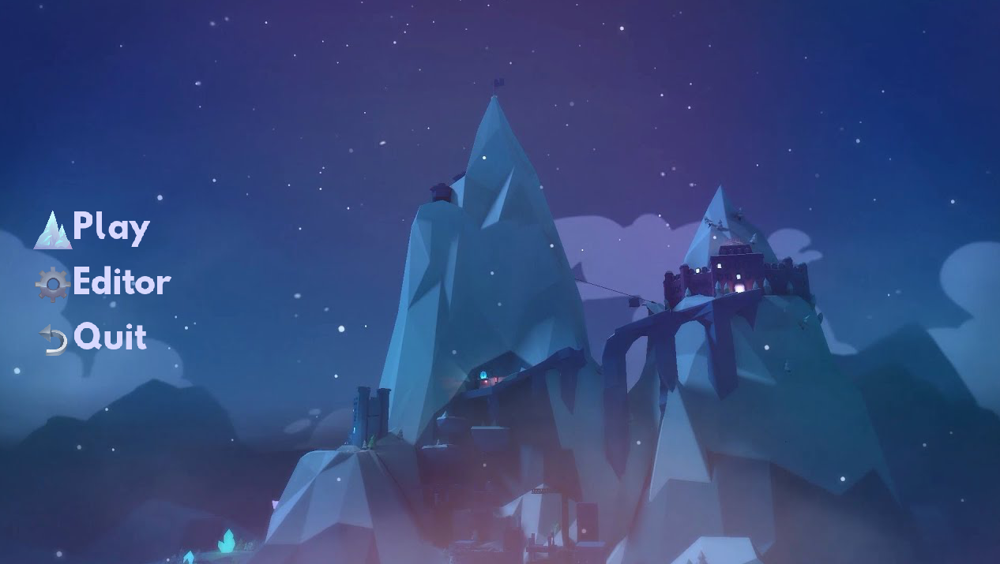

<!-- GENERAL GAME INFO -->
 

  <h1 align="center">Celeste</h1>

  

    Help Madeline survive her inner demons on her journey to the top of Celeste Mountain, in this super-tight platformer from the creators of TowerFall. Brave hundreds of hand-crafted challenges, uncover devious secrets, and piece together the mystery of the mountain.
     
    <strong>Original game : </strong>
    <a href="https://en.wikipedia.org/wiki/Celeste_(video_game)"><strong>General info »</strong></a>
    ·
    <a href="https://www.youtube.com/watch?v=6GlTmtXA7WA"><strong>Youtube video »<strong></a>
     
     
  

<!-- TABLE OF CONTENTS -->

  
Table of Contents

  <ol>
    <li>
      <a href="#about-the-project">About The Project</a>
    </li>
    <li>
      <a href="#my-version">My version</a>
    </li>
    <li>
      <a href="#getting-started">Getting Started</a>
    </li>
    <li><a href="#how-to-play">How To Play</a></li>
    <li><a href="#class-structure">Class structure</a></li>
    <li><a href="#checklist">Checklist</a></li>
    <li><a href="#contact">Contact</a></li>
    <li><a href="#acknowledgments">Acknowledgments</a></li>
  </ol>

<!-- ABOUT THE PROJECT -->
## About The Project

Why I chose Celeste:
- 1 of my all-time favorite platformers
- Breathtaking pixel artstyle
- Beautiful synth music
- Precise and coordinated fast-paced gameplay

(<a href="#readme-top">back to top</a>)

## My version

This section gives an overview of which parts of the original game I plan to make.

I will re-create the Badeline boss fight from Chapter 6 called reflection in as much detail as possible.

    <a href="https://www.youtube.com/watch?v=H9xwR2jB26k"><strong>Bossfight video»<strong></a>

### The minimum I will most certainly develop:
#### Level:
* 10 screens (entire chase/fight sequence is 21 screens)
* Per screen all obstacles/things Madeline can collide with, die from or interact with
    - falling platforms
    - disappearing platforms
    - pink spikes
    - jump springs
* Smooth Screen transitions

#### Mechanics:
Madeline:
* Move left/right
* Jump
* Crouch
* Grab
* Dash, Super Dash, Hyper Dash, Extended Super Dash, Extended Hyper Dash

    <a href="https://celestegame.fandom.com/wiki/Moves"><strong>Mechanics Wiki,<strong></a>
    <a href="https://www.youtube.com/watch?v=-SQKKG7Dz5c"><strong>Mechanics Video<strong></a>

Badeline:
* Badeline laser attack
* Badeline Bullet attack

#### Pickups:
* Dash Crystals

#### Graphics:
* Pixel art tileset for "main" layer Madeline sits on/collides with
* Sprite Animations for Madeline mechanics
* Sprite Animation for Badeline mechanics
* Background wind effect
* Particle effects for Madeline mechanics
* Particle effects for Badeline attacks

#### Sound:
* Background music
* Sound effects for:
  - jumping
  - dashing
  - hitting Badeline
  - badeline Bullet Attack
  - badeline Laser Attack
  - collecting Dash Crystals
  - falling platforms

### What I will probably make as well:
Depends on how much time I have left, see section below.

### What I plan to create if I have enough time left:
* All 21 screens
* Other player mechanics
* Tentacles following Badeline (foreground and background layer)
* Other background layers
* Talking sequences with Badeline (text bubbles)
* Environment animations (water, plants)
* Lighting effects around Madeline and Badeline

(<a href="#readme-top">back to top</a>)

## Final Screenshots

<!-- GETTING STARTED -->
## Getting Started
### Prerequisites
* Visual Studio 2022
* Controller and keyboard support (recommend with controller)

### How to run the project
* Get the latest project version from GitHub or find the .zip on leho
* Open DAE_Jeroen_Denayer.sln
* Press ctrl + F5 inside of Visual Studio to run the project

(<a href="#readme-top">back to top</a>)

<!-- HOW TO PLAY -->
## How to play
### Game Controls
Coontroller:
* L-Joystick X: move left/right
* L-Joystick down: crouch
* X: jump
* R1/Right Shoulder + L-Joystick direction: dashing
* R2/Right Trigger + against a wall + L-Joystick Y: wall grabbing, climbing, sliding

Keyboard:
* Left/Right arrow key: move left/right
* Up aroow key: jump
* Down arrow key: crouch
* D: dash
* G: grab
### UI controls
* Mouse: Select and click buttons
* Up/Down arrow keys, L-Joystick Y: move up/down in the UI
* LMB, Enter, X: press a button
### Editor Controls
#### General
* Scroll wheel: Change mode
* Enter: Enter a selected mode
* Escape: Exit a mode
#### EdtiLevelScreen mode specifics
* B: add a falling block
* C: add a dash crystal

## Player movement examples
Running:

Crouching:

Jumping:

Wall Grabbing, Climbing, Sliding:

Wall Hopping:

Wall Jumping:

Wall Neutral Jumping:

Dashing:

(<a href="#readme-top">back to top</a>)

<!-- CLASS STRUCTURE -->
## Class structure 
### General:
* Game class: Handles switching between the MainUI, playing the game and working in the level editor.
* LevelScreen class: This is the primary class where interactions happen. From the player and other PhysicsBodies colliding with the level itself (not using the provides SVG method, but a custom collision system) to interactions between different PhysicsBodies. Each LevelScreen is completely stored on disk in 2 parts. The first being a .bmp that per pixel contains an index representing which tile should be drawn there. And secondly a .txt which contains all extra information like where the LevelScreenGates are located, where all the spikes are located and where other PhysicsBodies liek falling blocks and dash crystals are located.
* level class: This a layer on top of the LevelScreen class that handles loading and managing the active LevelScreen and moving between different LevelScreens. As well as handling Madeline (the player) and Badeline (the boss) to make sure these 2 are able to correctly move between LevelScreens.
* Player/Madeline class: The player is capable of a wide range of moves and states it can switch between. The Madeline/player class is controllable by the user via interaction with the InputManager class.
* The PhysicsBody class: This is the base class where most interacteable objects inherit from (not all like Spikes and LevelScreenGates). Which contains a virtual Draw(), Update() and CollisionInfoResponse() method. 
* Different Managers:
    * InputManager: handles all user input Events
    * AssetManager: handles keeping track of all the different assets like textures and sound
    * FileIO: handles all the reading and writing to disk
* LevelEditor class: Allows you to more easily place around certain objects like Spikes/Dash Crystals or FallingBlocks in a LevelScreen.
## Specific techniques
### Object composition
* LevelScreen.h: 
    - has a vector with all the PhysicsBodies that it contains. It fully manages these physicesbodies although there are some exceptions like Madeline (Madeline.h) and Badeline (Badeline.h) who are able to transfer between different LevelScreens through LevelScreenGates (LevelScreenGate.h). This transfering is done by the Level class (Level.h).
    - has a vector containing all the LevelScreenGates it has
* Madeline.h:
    - contains a MultiSpriteSheet (MultiSpriteSheet.h), fully manages the creation, updates during its lifetime and deletion of this object.
* Badeline.h:
    - contains a MultiSpriteSheet as well.
* UIPanel.h:
    - contains a vector of Buttons (Button.h)
### Inheritance 
* PhysicsBody.h:
    - Madeline, Badeline, FallingBlock and DashCrystal all inherit from the general PhysicsBody class. This forces these classes to override a Draw() and Update() function as well as a CollisionResponse() function.
* SpriteSheet.h:
  - MultiSpriteSheet inherits from SpriteSheet. This MultiSpriteSheet class makes use of the protected data members and the draw function of the SpriteSheet class. As well as overriding the Update() method.

### Polymorphism
Not really used in the sence of typecasting a PhysicsBody base pointer to a child pointer or vice versa. Each PhysicsBody contains a Type datamember by which I handle interactions between PhysicsBodies.

### Move semantics:
The Level class handles the different LevelScreens and switching between them. So it contains a m_pCurLevelScreen and a m_pNextLevelScreen. While loading a new LevelScreen, m_pNextLevelScreen is MOVED into m_pCurLevelScreen

### Streams and File IO
Used this a lot in the FileIO class as well as in the LevelScreen and LevelScreenGate class which have a Load() and Save() function to be able to store or read these from disk.

## Cool Extra's:
### Custom collision Sytem:
The collision between the player and each LevelScreen is handled solely based on the .bmp of the LevelScreen stored on disk. When a LevelScreen is loaded, this image is stored in a big 1D vector with each index representing a tile. It could be a "solid" tile or "air" tile where the player can move. Because the tiles are fixed to a certain grid size, I can immediatly calculate with which tiles the player is overlapping.
### Level Editor:
It was cumbersome to place around objects in the different rooms by just hardcoding some values. Which made me decide to build a very primitve editor with which I could place objects around and afterwards save the level to disk with ctrl+s.
### AssetManager:
Handles all the loading and unloading of assets like textures and sounds. Sometimes by communicating with the FileIO class to get textures from disk.
### FileIO class:
This class is solely responsible for reading and writing from and to disk.
I added functionality to easily read and write to a .txt file. This is used to store the description of a LevelScreen file on disk. Where each file contains multiple lines storing different information. The FileIO class has functions to store most common data types like ints, floats, int arrays, float arrays and Vector2f arrays.

(<a href="#readme-top">back to top</a>)

(<a href="#readme-top">back to top</a>)

<!-- CONTACT -->
## Contact
Jeroen Denayer - jeroen.denayer@student.howest.be

Project Link: https://github.com/HowestDAE/DAE14-Jeroen-Denayer

(<a href="#readme-top">back to top</a>)

<!-- ACKNOWLEDGMENTS -->
## Acknowledgments
### C++:
* Design pattern to load resources: https://www.reddit.com/r/gamedev/comments/1ubjdc/where_do_you_keep_textures_after_you_load_them/
* Passing managers/other "global" data to many classes/functions problem: https://cplusplus.com/forum/beginner/275653/
* SDL_GameController support: https://blog.rubenwardy.com/2023/01/24/using_sdl_gamecontroller/

### Collision/Physics:
* Collision engine: https://gamedev.stackexchange.com/questions/26501/how-does-a-collision-engine-work
* Tile-map collision method: https://jonathanwhiting.com/tutorial/collision/
* Swept AABB collision: https://www.gamedev.net/articles/programming/general-and-gameplay-programming/swept-aabb-collision-detection-and-response-r3084/
* celeste & towerfall physics: https://www.maddymakesgames.com/articles/celeste_and_towerfall_physics/index.html
* thread talking about collision: https://love2d.org/forums/viewtopic.php?t=86336
* reddit collision thread: https://www.reddit.com/r/gamedev/comments/exyp8/platformer_collision_detection_physics/
* Variable jump height: https://www.reddit.com/r/gamedesign/comments/ozaaj0/variable_jump_height_different_ways_to_do_it/

### Celeste Links:
* Celeste extracted art: https://www.reddit.com/r/celestegame/comments/i5nj6w/can_you_extract_the_background_art_from_levels/
* Level Art brakedown: https://aran.ink/posts/celeste-tilesets
* Tools used for celeste development: https://celestegame.tumblr.com/post/158491854009/tools
* Mechanics explained: https://celeste.ink/wiki/Techniques
* Mechanics distance info: https://www.neoseeker.com/celeste/Celeste_Basic_Controls
* Celeste game-feel info: https://www.reddit.com/r/gamedev/comments/fhzw5f/developer_of_celeste_shares_some_cool_gamefeel/

(<a href="#readme-top">back to top</a>)

